# Projeto de Automação
Criação de uma API simples para controle de estoque
## Obetivo
Esse projeto com como o objetivo de utilziar IoT em industria 4.0 e serviços em nuvem utilizando a linguagem de programação Python e no back-end utillização de java 
## Visão Geral
Este projeto visa a criação de uma API para conectar com serviços de nuvem da alexa para automatizar o processo de compras,caso um produto tiver dentro de uma quantidade mínima no estoqu ,a alexa pergunta apartir de um evento se o usuário gostaria de fazer a compra na amazon prime do produto .
## FRONT END
- **Tema claro:**
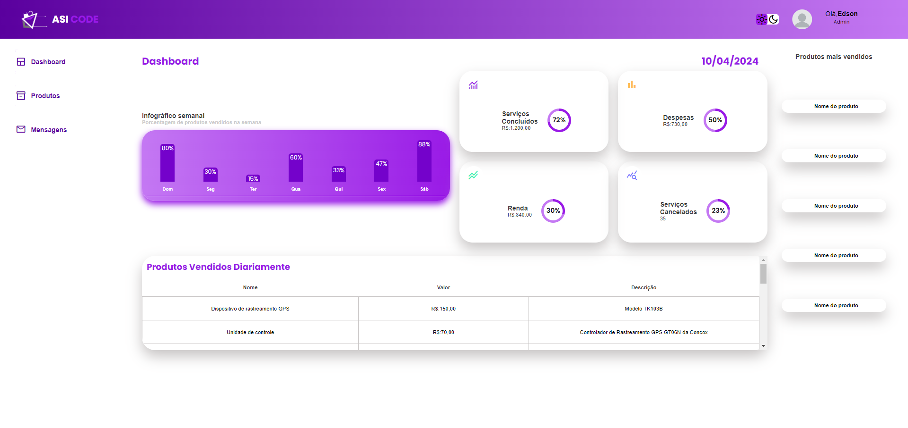
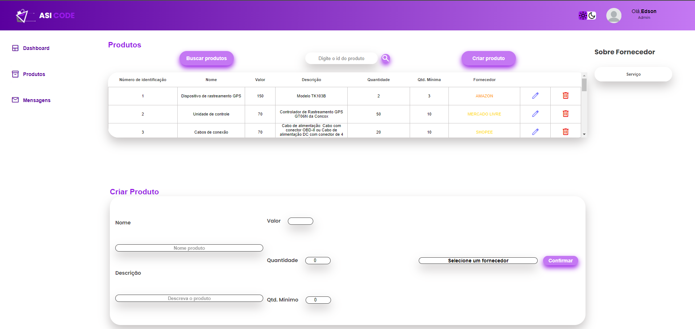
- **Tema escuto:**
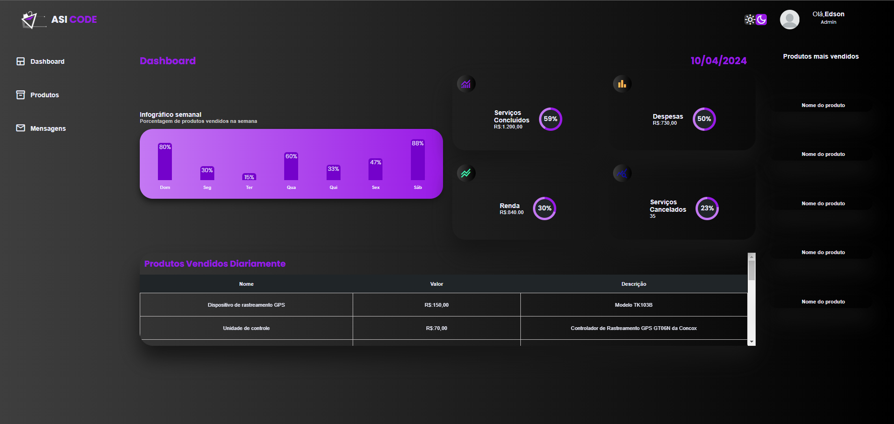
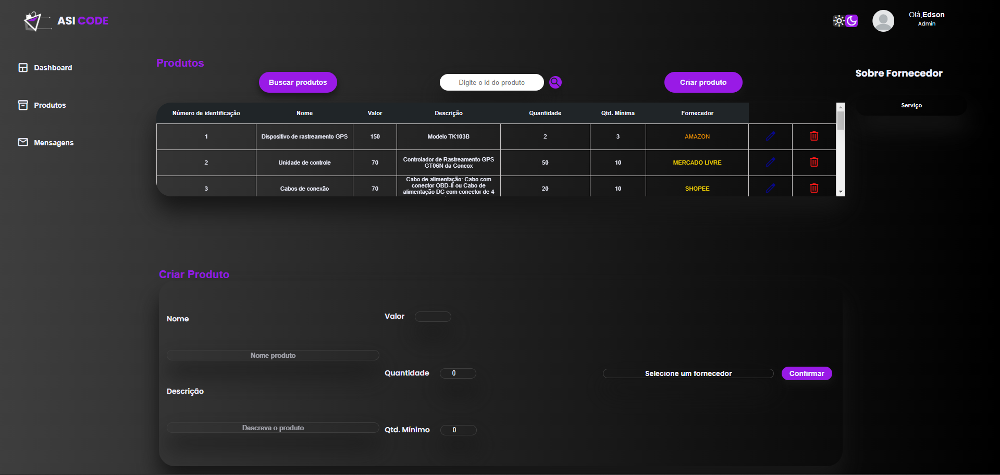

## Cloud alexa
- **Criação de skill:**
link :https://developer.amazon.com/alexa/console/ask
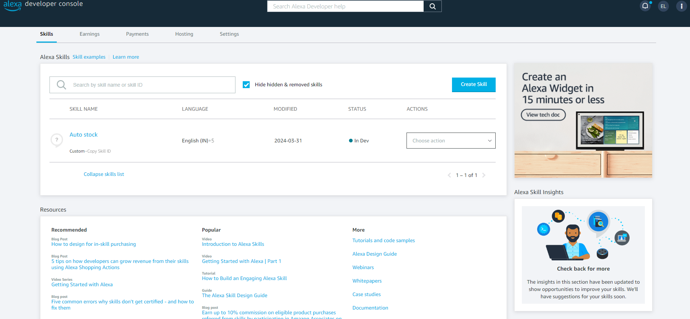
- **Etapa 1 :Nome e localidade:**
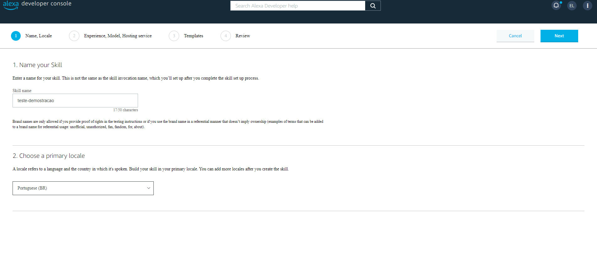
- **Etapa 2 :Experiência modelo,serviço e hospedagem:**
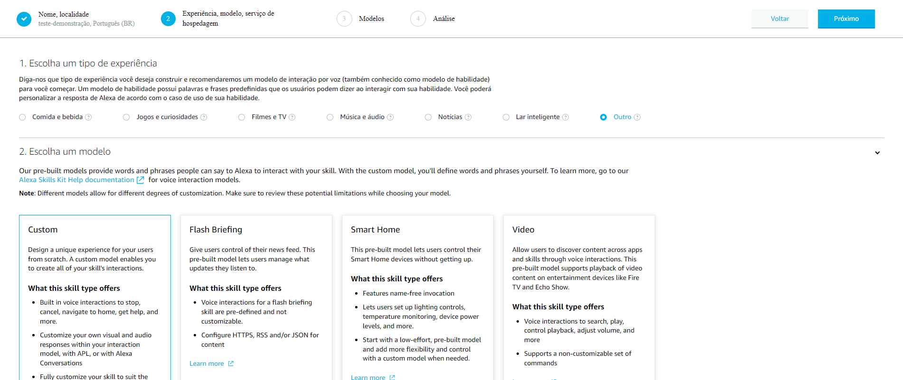
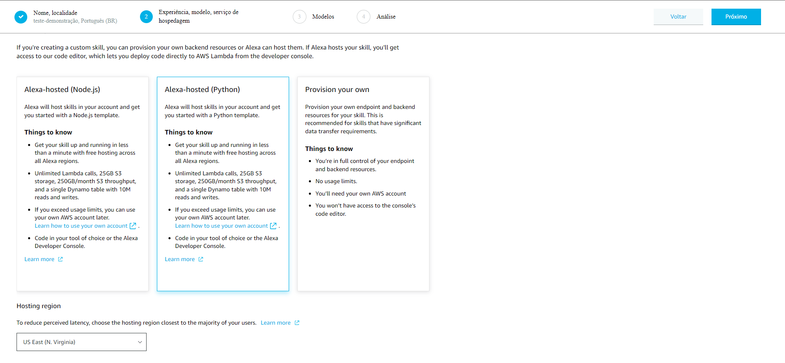
- **Etapa 3 :modelo:**
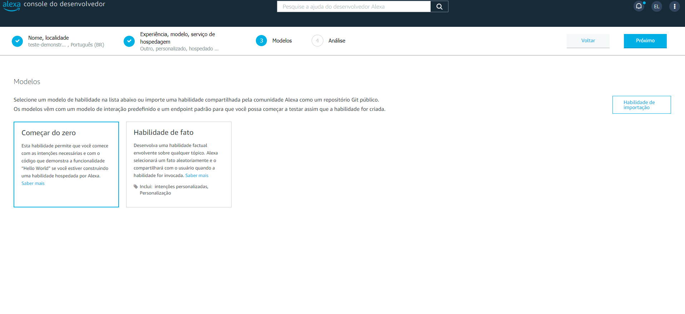
- **Etapa 4 :Análise:**
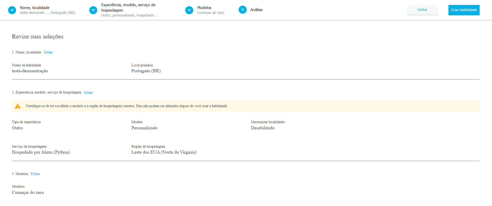
- **Aguarde a criação:**
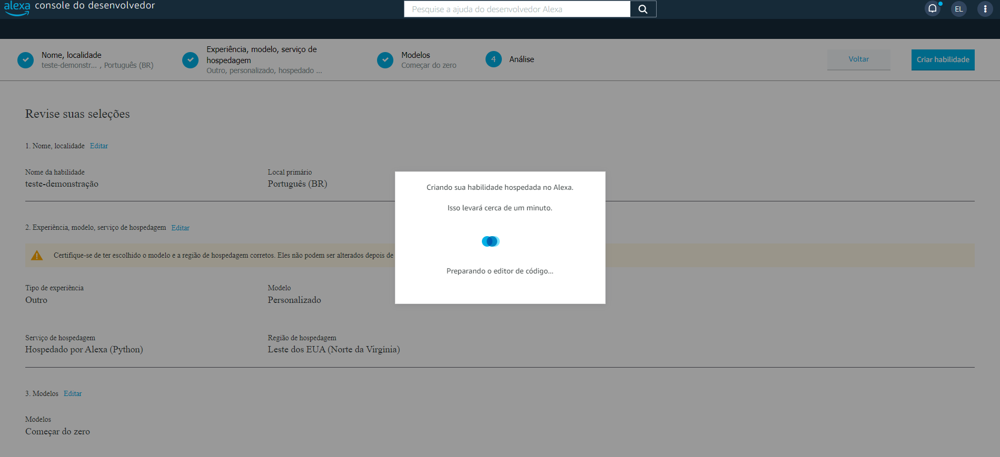
- **Nome da invocação:**
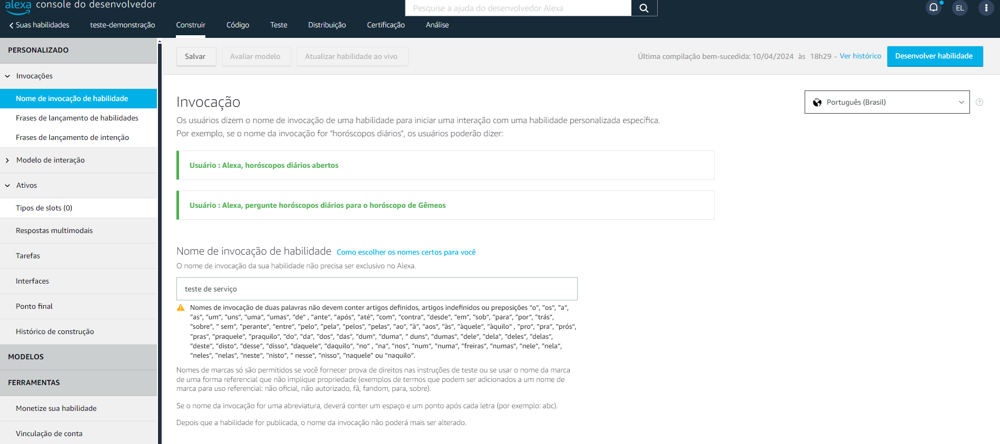
- **Adicionar a  intenção:**
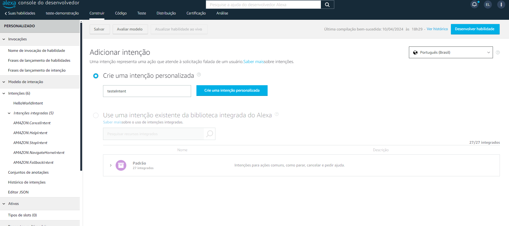
- **Adicionar o que o usuário pode dizer para chamar a intenção:**
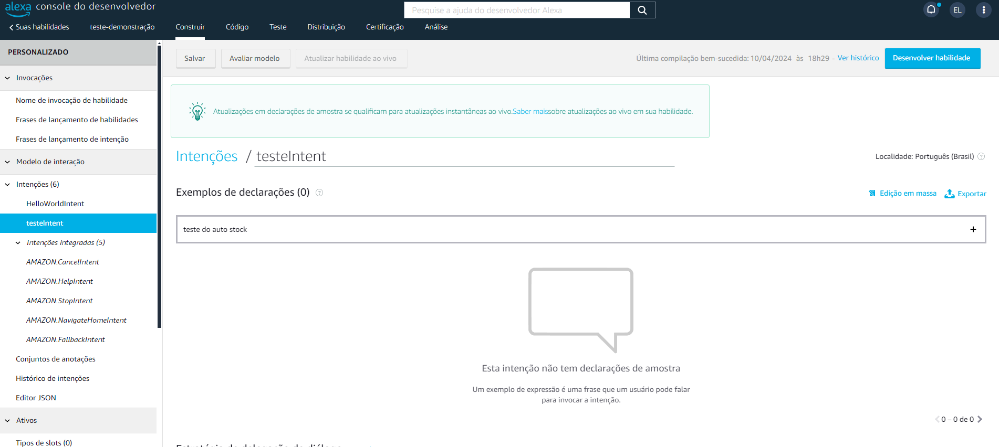
- **Crie seu código no code:**
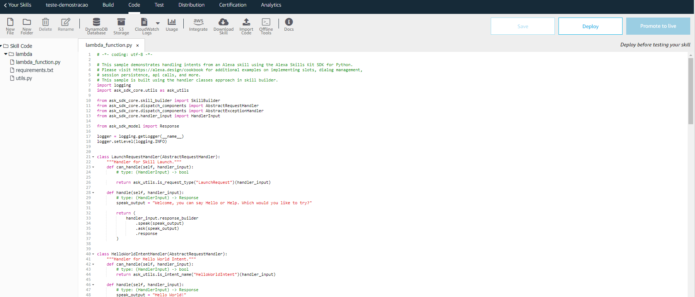
- **Declare ela no final do código:**
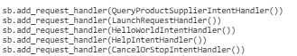
- **A intenção que você criou voce adiciona nesse trecho por exemplo no lugar do LaunchRequest:**
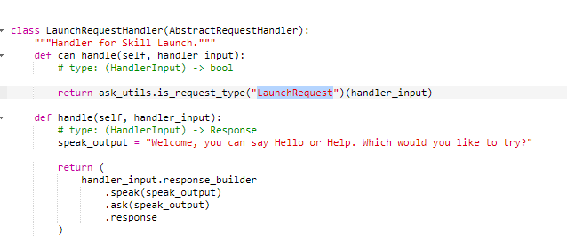
- **Aqui você testa o seu código usando a interação que você criou para o usuário ai dependendo do que você adicionou você tera a respota da alexa:**
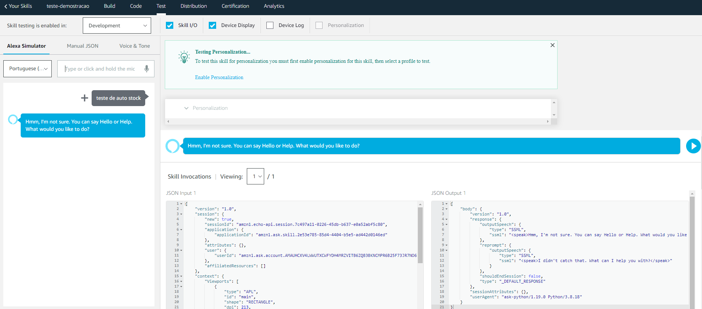
- **Exemplo do código para utilizar o autostock e buscando os produtos que estão abaixo ou igual a quantidade mínima do estoque:**
código em python
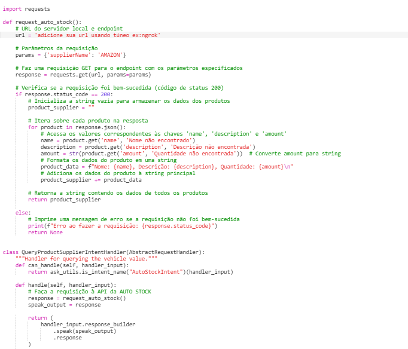

- **Observe a declaração da intenção criada:**
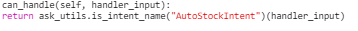
## Tecnologias Utilizadas
- **HTML:**

- **CSS:**

- **Javascrip:**

- **Spring Boot:** 

- **Java:** 

- **MySQL:** 

- **HeidiSQL:**

